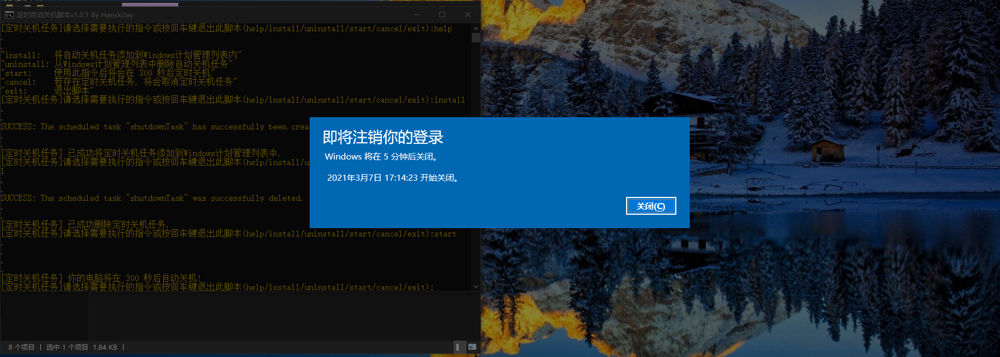
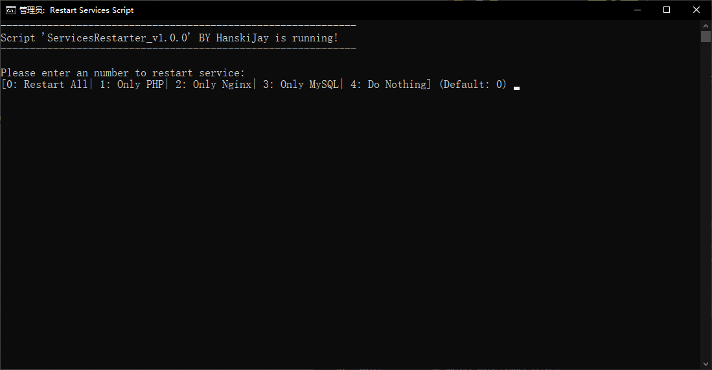
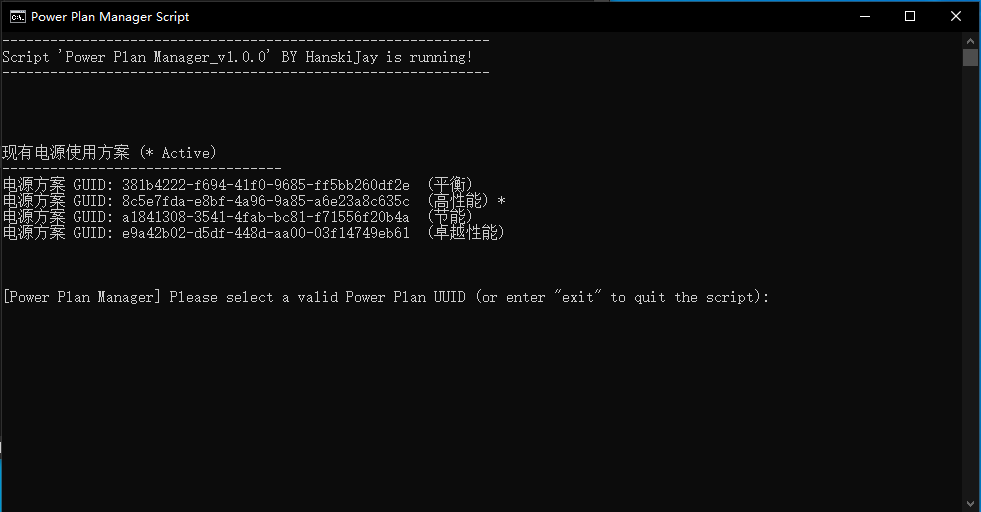
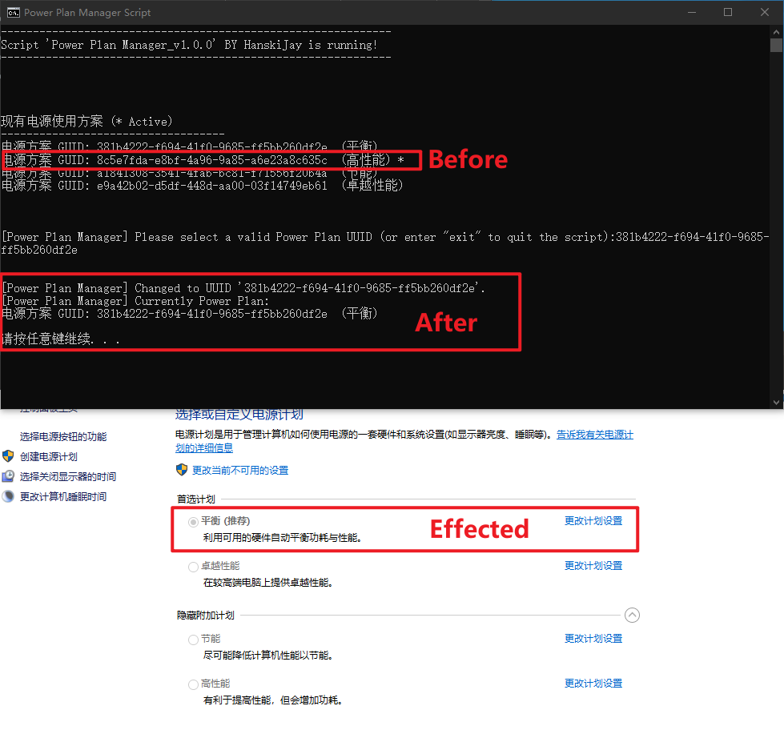

# WindowsScripts
这个仓库为本人编写的一些常用Windows可执行脚本, 有需要的欢迎拿走, 留下你的Star就好啦~

开源许可证:  [Learn More](https://opensource.org/licenses/MIT)

推荐将此脚本的根目录注册到Windows系统中的`PATH环境变量`中。方可快速使用`运行`或者`CMD`执行脚本。


------

## [1]AutoShutdowner 指令帮助
双击脚本运行后, 可以按照提示注册/删除自动关机任务.
1. 找到 `DAILY_TIME` 关键字样
2. 修改以下代码更改每天自动关机的时间:
```bash
set prefix=[定时关机任务]
REM 下方的 `DAILY_TIME=`的后面为标准日期格式的关机时间点(默认为每日凌晨3:00)
set DAILY_TIME=03:00
set /a SHUTDOWN_TIME=5*60
```
3.重新运行脚本后生效.

## 图片展示





## [2]ServiceRestarter 指令帮助
此脚本为可选择重启指定的已注册服务 (按自己需要修改).

## 图片展示



## [3]PowerPlan 指令帮助
此脚本可以快速修改当前系统的电源管理策略/计划。无需每次打开控制面板进入电源设置中修改。

## 图片展示



------

## Statement
&copy; 2016-2021 [`OwOBlog-DGMT`](https://www.owoblog.com). Please comply with the open source license of this project for modification, derivative or commercial use of this project.

> My Contacts:
- Website: [`HanskiJay`](https://www.owoblog.com)
- Telegram: [`HanskiJay`](https://t.me/HanskiJay)
- E-Mail: [`HanskiJay`](mailto:support@owoblog.com)
