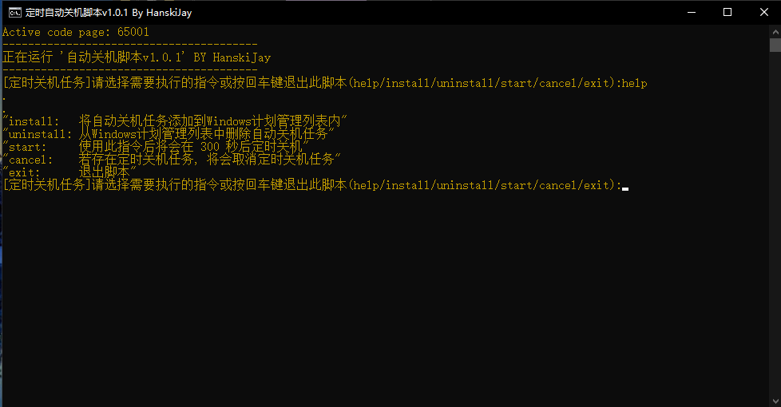
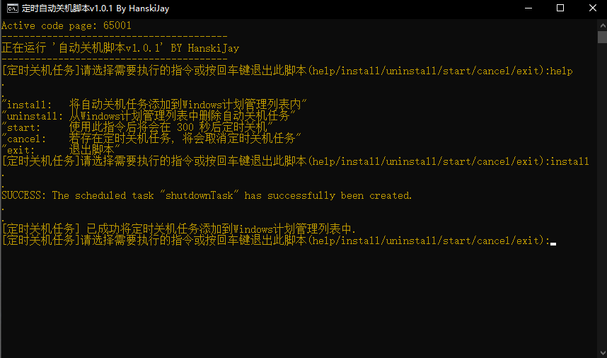
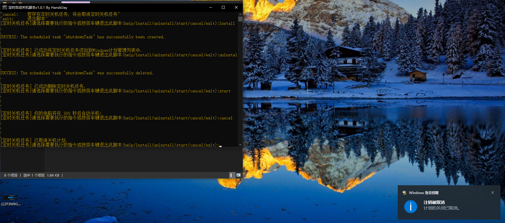

# AutoShutdowner
用于给系统注册定时自动关机的脚本（没啥卵用）
开源许可证:  [Learn More](https://opensource.org/licenses/MIT)


------

## 指令帮助
双击脚本运行后, 可以按照提示注册/删除自动关机任务.
1. 找到 `DAILY_TIME` 关键字样
2. 修改以下代码更改每天自动关机的时间:
```bash
set prefix=[定时关机任务]
REM 下方的 `DAILY_TIME=`的后面为标准日期格式的关机时间点(默认为每日凌晨3:00)
set DAILY_TIME=03:00
set /a SHUTDOWN_TIME=5*60
```
3.重新运行脚本后生效.

## 图片展示








------

## Statement
&copy; 2016-2021 [`OwOBlog-DGMT`](https://www.owoblog.com). Please comply with the open source license of this project for modification, derivative or commercial use of this project.

> My Contacts:
- Website: [`HanskiJay`](https://www.owoblog.com)
- Telegram: [`HanskiJay`](https://t.me/HanskiJay)
- E-Mail: [`HanskiJay`](mailto:support@owoblog.com)
